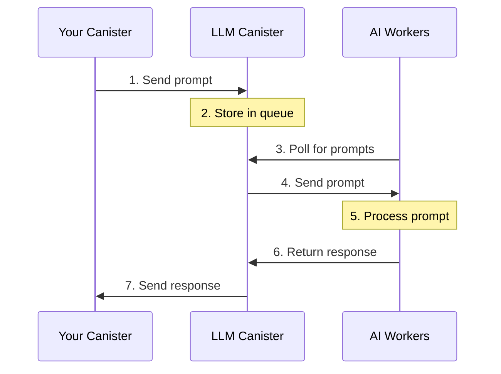

<!-- Generated by SpecStory -->

# Restructuring README for Clarity and Presentation (2025-03-15 14:29:09)

_**User**_

This is my README 

I want you to help me restructure and refine it properly, DO NOT REMOVE OR EDIT THE ORIGINAL CONTENT. Just restructure how the content is being displayed i.e adding bold, italics, underline, code comments where necessary. Bullet points e.t.c 

Once again, the content should remain as it is, do not edit any line, just work on the display format of the content

---

_**Assistant**_

I'll help you restructure the README while preserving all the original content, just enhancing its presentation. Here's the reformatted version:

# Create an LLM Chatbot using ICP Ninja & LLM Canister 

## Table of Contents
1. [Introduction to ICP Ninja](#introduction-to-icp-ninja)
2. [Introduction to LLM Canister](#introduction-to-llm-canister)
3. [Create an LLM Chatbot using ICP Ninja & LLM Canister](#create-an-llm-chatbot-using-icp-ninja--llm-canister)

## Introduction to ICP Ninja 

> ICP Ninja is a Web Based development environment that is designed to simplify the creation and deployment of applications on ICP

It will help developers who want to quickluy get started with building on ICP, without going through the whole process of complex setups 

### What is ICP Ninja: 
[ICP Ninja](https://icp.ninja) is a browser based IDE (Intergrated Development Environment) that allows someone to: 
* Directly build and deplpy ICP canisters directly from the web browser 
* Develop applications without downloading the canister development kit (CDK), create a developer identity, or acquire cycles
* Access project templates that show ICP's unique capabilities 
* Deploy projects with a simple click of a button 

📝 *Check out the official article [here](https://medium.com/dfinity/enhancing-icp-dapp-development-using-icp-

---

_**User**_

Please edit the @README.md file directly

---

_**Assistant**_

I'll help you restructure the README.md file. Here's how we can enhance the formatting while keeping all content intact:

```markdown:README.md
# Create an LLM Chatbot using ICP Ninja & LLM Canister 

## 📑 Table of Contents
1. [Introduction to ICP Ninja](#introduction-to-icp-ninja)
2. [Introduction to LLM Canister](#introduction-to-llm-canister)
3. [Create an LLM Chatbot using ICP Ninja & LLM Canister](#create-an-llm-chatbot-using-icp-ninja--llm-canister)

# Introduction to ICP Ninja 

> ICP Ninja is a Web Based development environment that is designed to simplify the creation and deployment of applications on ICP

It will help developers who want to quickluy get started with building on ICP, without going through the whole process of complex setups 

## What is ICP Ninja: 
[ICP Ninja](https://icp.ninja) is a browser based IDE (Intergrated Development Environment) that allows someone to: 
* Directly build and deplpy ICP canisters directly from the web browser 
* Develop applications without downloading the canister development kit (CDK), create a developer identity, or acquire cycles
* Access project templates that show ICP's unique capabilities 
* Deploy projects with a simple click of a button 

📝 Check out the official article [here](https://medium.com/dfinity/enhancing-icp-dapp-development-using-icp-ninja-ai-11d5dad408ef#6423)

## ✨ Key features: 
ICP Ninja has these key features: 
1. **Easy Deployment**: Select a template project and click "Deploy" to get your application running on the mainnet
2. **Multiple language support**: Develop in Motoko, Rust, and (in pipeline) Typescript & Python
3. **AI Learning Assistant**: get help with code explanation, fixing and optimization from AI assistant trained on the documentation 
4. **Project Sharing**: Share whatever projects you've made with others via direct links, or export to GitHub 
5. **Authentication Options:** Log in with [internet identity](https://internetcomputer.org/internet-identity) or [Github](https://github.com/) to save your progress
6. **Developer Tools:** Access canister logging, live project compilation logs, and a professional code editor

## 🚀 Getting started & How to use ICP Ninja: 
1. **Access the platform**: Visit [icp.ninja](https://icp.ninja)


2. **Choose a project**: Select from example templates or start a new project

### Create a new project and start from scratch 


* Select the project type: whether fullstack, backend only or frontend only 
* Select the backend language, currently supported ones are motoko and rust only 
* Click on "Create Project" to get started

**OR**

From the example templates, click on the project you want to use.


For my case I've choosen LLM Chatbot 


* I will then select my preferred language, motoko or rust
* Then check out the 13 steps that serve as an introduction to make you familiar with the online IDE. Go through them keenly to understand the editor and utilize the different features present. 

> **Note**: Deployed projects remain active for 20 minutes but can be redeployed as needed. For long-term development, you'll want to migrate to a local environment.

Now that we have an understanding of ICP Ninja, let's proceed to create an LLM Chatbot using ICP Ninja and the LLM Canister. 

# Create an LLM Chatbot using ICP Ninja & LLM Canister 

## Section 1: Introduction to LLM Canister: 

LLMs can now be accessed directly from a canister with just a few lines of code. This guide will help you understand how it works and get started quickly.

### 🔄 How does it work?

The LLM Canister system uses "AI Workers" to process prompts efficiently and securely.

**AI Workers:** These are stateless nodes that are set up for the sole purpose of processing LLM prompts.

### 📊 System Architecture Flow



### 🔍 Process Overview:
1. Your canister sends prompts to the LLM canister
2. LLM Canister queues the prompts
3. AI Workers continuously check for new prompts
4. AI Workers process the prompts using Llama 3.1 8B
5. Responses are returned to the LLM Canister
6. Your canister receives the processed result

## 💻 Quick Start

### Rust Example
```rust
use ic_llm::Model;

// Simple prompt
ic_llm::prompt(Model::Llama3_1_8B, "What's the speed of light?").await;

// Chat with multiple messages: when you want your model to maintain context accross multiple messages e.g chat message or when simulating a conversation
use ic_llm::{ChatMessage, Role};

ic_llm::chat(
    Model::Llama3_1_8B,
    vec![
        ChatMessage {
            role: Role::System, // System sets the context behaviour of the model
            content: "You are a helpful assistant".to_string(),
        },
        ChatMessage {
            role:

---


---

