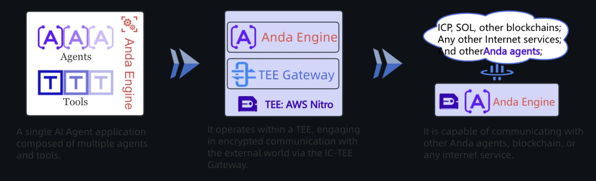

# What is Anda? 
This is an innovative agent that has been developed to build composable, autonomous, permanent memory-enabled AI agent network. It connects agents across various industries. 

### How does it work?
- A single AI Agent application composed of multiple agent and tools. 
- Operates in ICP-TEE (Trusted Execution Environment): thus it engages in encrypted communication with the external world.
- Can communicate with any other agent, blockchain or internet service.


### Key Features:

### What is a TEE: 
This is a secure area within a computer processor that ensures confidentiality and integrity of code and data loaded inside it. 

TEEs are proposed to exist on ICP blockchain, it's benefits include: 
- Secures against attacks from rogue individuals at the organization level. 
- Increases security in terms of integrity and privacy against privileged local attackers.
- Provide additional means for users to validate the integrity of ICP Blockchain. 

## How to get started and deploy your first ICP Powered AI Agent: 

#### Prerequisites:
- Have docker installed on your machine 
- Have rust installed on your machine
- Ensure you have ICP dfx tool on your machine too 

1. Install [IC TEE CLI](https://github.com/ldclabs/ic-tee) tool: 
```bash
cargo install ic_tee_cli
ic_tee_cli --help # check out the list of commands
``` 

This will be the output after the latter command: 
```bash
A command-line tool implemented in Rust for the IC-TEE.

Usage: ic_tee_cli [OPTIONS] [COMMAND]

Commands:
  identity-new         create a identity and save to a file
  identity-derive      derive the principal with canister and seeds
  tee-verify           verify a TEE attestation document
  setting-get          get a setting from the COSE canister
  setting-upsert-file  save a identity to the COSE canister
  setting-save-tls     save a tls certificate to the COSE canister
  help                 Print this message or the help of the given subcommand(s)

Options:
  -i, --identity <PEM_FILE>  The user identity to run this command as [default: Anonymous]
  -c, --canister <CANISTER>  [default: ]
      --ic                   
  -h, --help                 Print help
  -V, --version              Print version
```

2. Verify online TEE attestation (Retrieve Anda Bots attestation document from the URL and verifies its authenticity): 
```bash
ic_tee_cli tee-verify --url https://andaicp.anda.bot/.well-known/attestation
``` 

3. Generate a new identity and utilize it within the ``ic_tee_cli`` tool: 

Generate a new identity: 
```bash 
ic_tee_cli identity-new --path myid.pem
``` 
- ``identity-new``: This subcommand generates a new identity. 
- ``--path myid.pem``: Specifies the file path where the new identity's private key will be saved.

This will generate a new identity and save it to the specified file path. It will then output the principal identifier such as ``vh57d-**-nqe``

Use the generated identity: 
```bash 
ic_tee_cli -i myid.pem
``` 

- ``-i myid.pem``: Specifies the identity file to be used for subsequent ic_tee_cli commands.

By including the ``-i myid.pem`` option, you're instructing ``ic_tee_cli`` to use the identity associated with ``myid.pem`` for authentication in future operations.

4. Prepare the anda bot: 
Copy the [deployment files](https://github.com/ldclabs/anda/tree/main/agents/anda_bot/nitro_enclave) for anda bot: 
```bash 
git clone --depth 1 https://github.com/ldclabs/anda.git
cp -r anda/agents/anda_bot/nitro_enclave my_bot
cd my_bot
``` 

5. Deploy [IC COSE Service](https://github.com/ldclabs/ic-cose/tree/main/src/ic_cose_canister#ic_cose_canister): 
IC Cose is a smart service on ICP Blockchain for storing configurations, deriving keys and fixed identity IDs. 

Clone the repo:
```bash 
git clone https://github.com/ldclabs/ic-cose.git
cd ic-cose
```

Now deploy the canister
```bash
# open dfx json and then modify the ic_cose_canister name to your own preferred "unique" name e.g steves_ic_cose_canister

# delete canister_ids.json file if it exists

# create the canister
dfx canister --network ic create --with-cycles 1_000_000_000_000 steves_ic_cose_canister

# deploy the canister
dfx deploy steves_ic_cose_canister --argument "(opt variant {Init =
  record {
    name = \"My test bot\";
    ecdsa_key_name = \"dfx_test_key\";
    schnorr_key_name = \"dfx_test_key\";
    vetkd_key_name = \"test_key_1\";
    allowed_apis = vec {};
    subnet_size = 0;
    freezing_threshold = 1_000_000_000_000;
  }
})" --ic
``` 

Once deployed you can also follow the next steps: 
```bash
# Get the canister state info 
dfx canister call steves_ic_cose_canister state_get_info '()' --ic

# Get and store your principal ID
MYID=$(dfx identity get-principal)

# Now add the principal ID that was stored as a manager
dfx canister call steves_ic_cose_canister admin_add_managers "(vec {principal \"$MYID\"})" --ic
 
# The next step is to retrieve the ECDSA public key from the canister
dfx canister call steves_ic_cose_canister ecdsa_public_key '(null)' --ic

# Retrieve the Ed25519 Schnorr public key
dfx canister call steves_ic_cose_canister schnorr_public_key '(variant { ed25519 }, null)' --ic

# Creates a new namespace called "testing" with specific parameters:
  # name: "testing"
  #  visibility: 1 (public)
  #  max_payload_size: 1MB
  #  managers: your principal ID
  #  empty auditors and users lists

dfx canister call steves_ic_cose_canister admin_create_namespace "(record {
  name = \"testing\";
  visibility = 1;
  desc = null;
  max_payload_size = opt 1_000_000;
  managers = vec {principal \"$MYID\"};
  auditors = vec {};
  users = vec {};
})" --ic

# List the namespaces in the canister
dfx canister call steves_ic_cose_canister admin_list_namespace "(null, null)" --ic

# Add specified principal IDs as users to the "testing" namespace, giving them access to use the namespace
dfx canister call steves_ic_cose_canister namespace_add_users "(\"testing\", vec {principal \"5mqc2-eelsb-rpsbu-tvroe-paiy3-c4wo3-4xl6q-7nelg-gprk3-rkq46-mqe\"})" --ic

# Add IC TEE CLI's principal ID as a manager: 
  # You can get the principal ID of the IC TEE CLI by running the following command: 
ic_tee_cli identity-new --path myid.pem

dfx canister call steves_ic_cose_canister namespace_add_managers '("testing", vec { principal "pmtkc-yrrvx-cb5jw-ouoy6-gfxry-fuwyc-qphva-mbcfl-tnhz5-ftitz-3qe" })' --ic

# Query fixed identity ID for mybot
dfx canister call ic_cose_canister namespace_get_fixed_identity '("my_namespace", "mybot")' --ic

# Add mybot as a delegator
dfx canister call steves_ic_cose_canister namespace_add_delegator '(record {
  ns = "my_namespace";
  name = "mybot";
  delegators = vec { principal "<principal_id_of_bot>" };
})' --ic
``` 

6. Deploy the [IC Object Store Service](https://github.com/ldclabs/ic-cose/blob/main/src/ic_object_store_canister/README.md):
The next step is deploying the IC Object Store Service and adding ``mybot`` as a controller. It is is a single-tenant smart contract service on ICP for storing anda_bot knowledge and data
```bash
dfx deploy ic_object_store_canister --ic 
```

7. TEE Server: 
The next step is to set up an AWS Nitro Enclave instance with Docker and Nitro Enclave tools. Recommended: c5a.2xlarge (8 cores, 16GB RAM).


