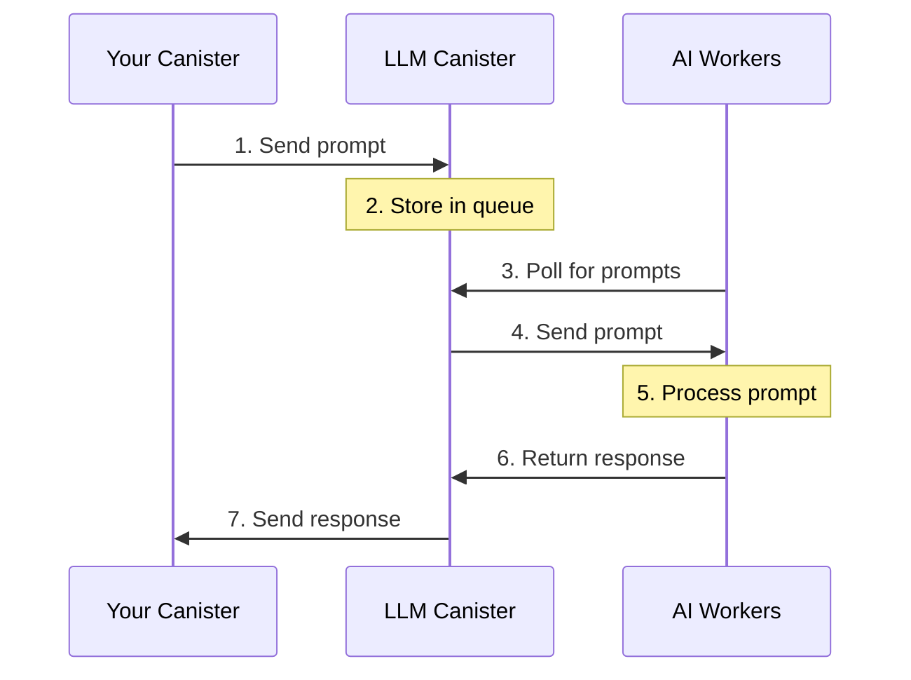

## Section 1: Introduction to LLM Canister: 

LLMs can now be accessed directly from a canister with just a few lines of code. This guide will help you understand how it works and get started quickly.

### 🔄 How does it work?

The LLM Canister system uses "AI Workers" to process prompts efficiently and securely.

**AI Workers:** These are stateless nodes that are set up for the sole purpose of processing LLM prompts.

### 📊 System Architecture Flow



### 🔍 Process Overview:
1. Your canister sends prompts to the LLM canister
2. LLM Canister queues the prompts
3. AI Workers continuously check for new prompts
4. AI Workers process the prompts using Llama 3.1 8B
5. Responses are returned to the LLM Canister
6. Your canister receives the processed result

## 💻 Quick Start

### Rust Example
```rust
use ic_llm::Model;

// Simple prompt
ic_llm::prompt(Model::Llama3_1_8B, "What's the speed of light?").await;

// Chat with multiple messages: when you want your model to maintain context accross multiple messages e.g chat message or when simulating a conversation
use ic_llm::{ChatMessage, Role};

ic_llm::chat(
    Model::Llama3_1_8B,
    vec![
        ChatMessage {
            role: Role::System, // System sets the context behaviour of the model
            content: "You are a helpful assistant".to_string(),
        },
        ChatMessage {
            role: Role::User, // This represents the user's inputs
            content: "How big is the sun?".to_string(),
        },
    ],
).await;
```

### Motoko Example
```motoko
import LLM "mo:llm";
// Simple prompt
await LLM.prompt(#Llama3_1_8B, "What's the speed of light?");

// Chat with multiple messages
await LLM.chat(#Llama3_1_8B, [
  {
    role = #system_;
    content = "You are a helpful assistant.";
  },
  {
    role = #user;
    content = "How big is the sun?";
  }
]);
```

## ℹ️ Important Details

### Current Status
- LLM Canister Principal: `w36hm-eqaaa-aaaal-qr76a-cai`
- The LLM Canister is currently controlled by the DFINITY team (until stability is achieved)
- AI Workers are managed by the DFINITY team
- Service is currently free to use

### 📚 Libraries
1. [Rust Library](https://docs.rs/ic-llm/latest/ic_llm/)
2. [Motoko Library](https://mops.one/llm)

### ⚠️ Limitations
1. **Model Support:**
   - Currently only Llama 3.1 8B model is supported
   - More models planned based on community feedback

2. **Request Constraints:**
   - Maximum 10 messages per chat request
   - Prompt length across all messages cannot exceed `10kiB`
   - Output is limited to `200` tokens

### 🔒 Privacy Considerations
- Prompts are not completely private
- AI Worker operators can theoretically see prompts
- User identity remains anonymous
- DFINITY only logs aggregate metrics (request counts, token usage)

## 🔮 Future Developments
1. **Latency Improvements:**
   - Working on reducing end-to-end request time
   - Exploring non-replicated mode for faster response

2. **Decentralization Plans:**
   - Moving towards decentralized AI worker deployment
   - Exploring "badlands" concept for permissionless worker operation