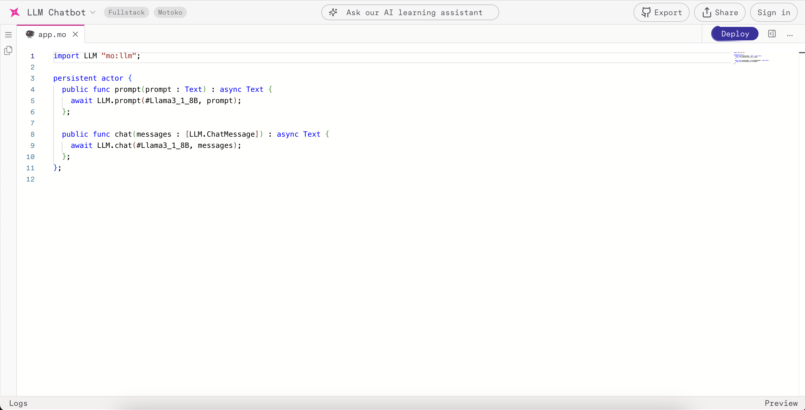
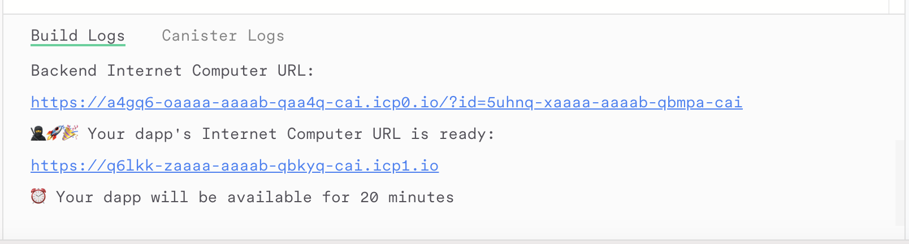
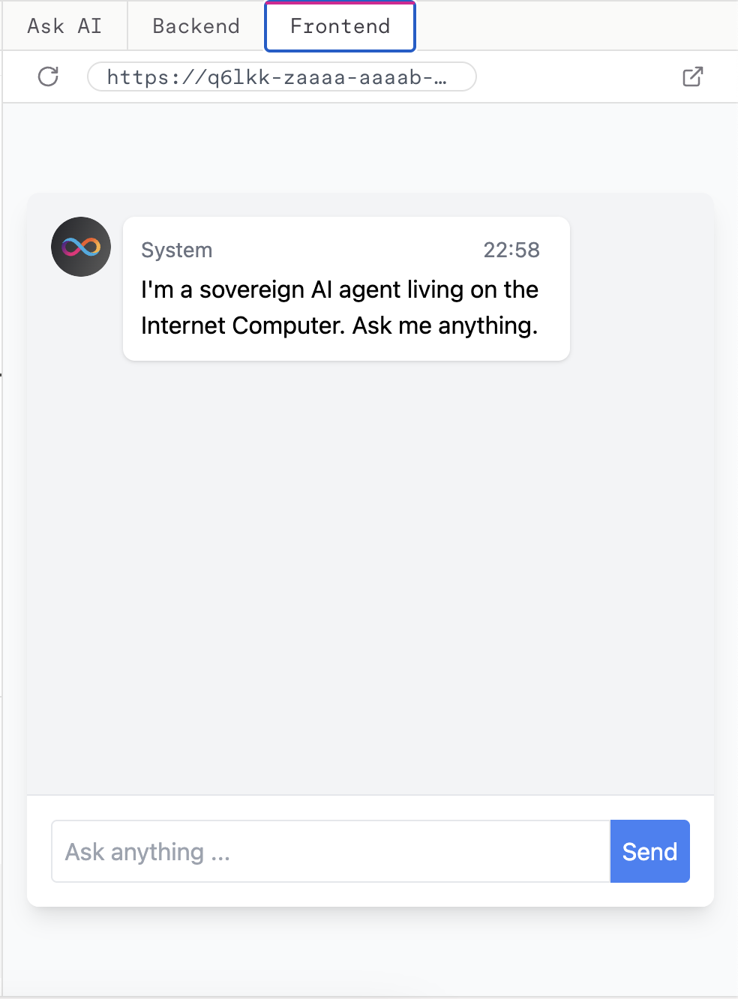
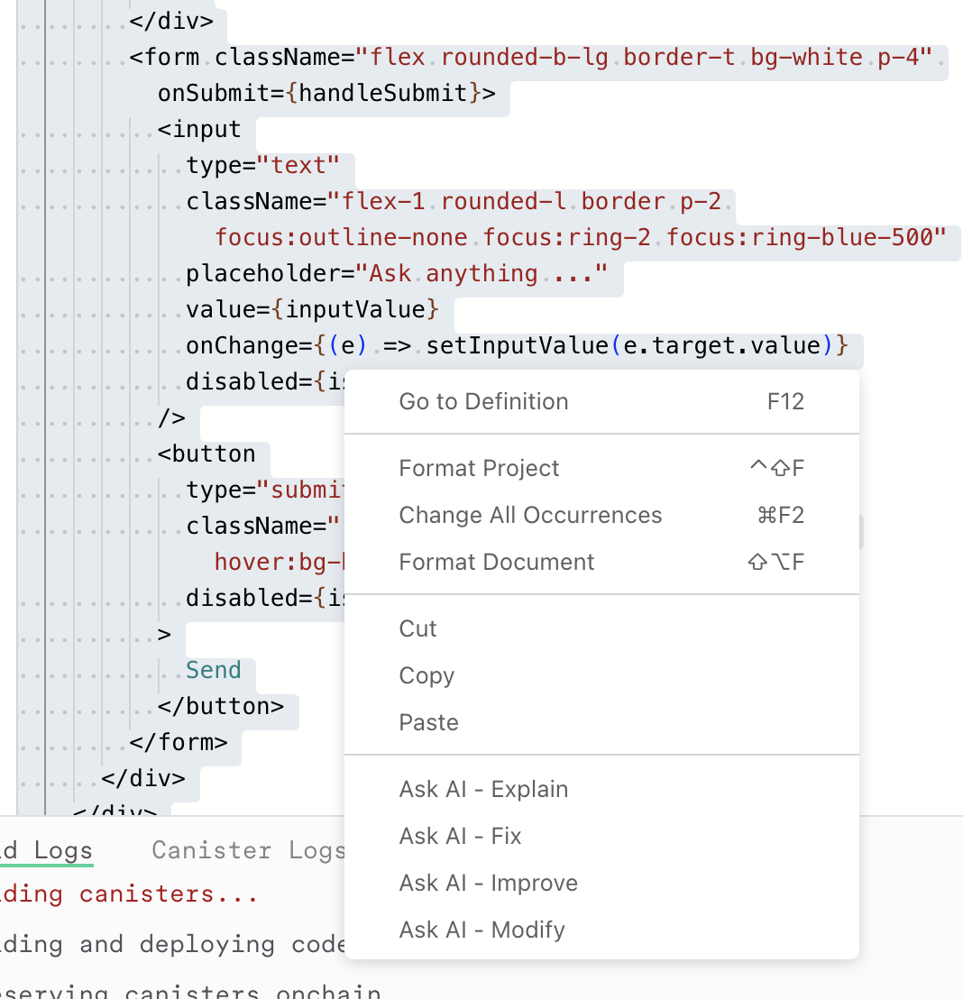
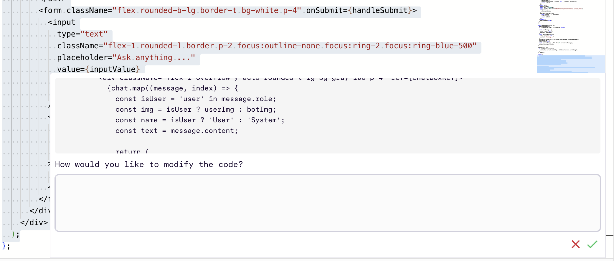
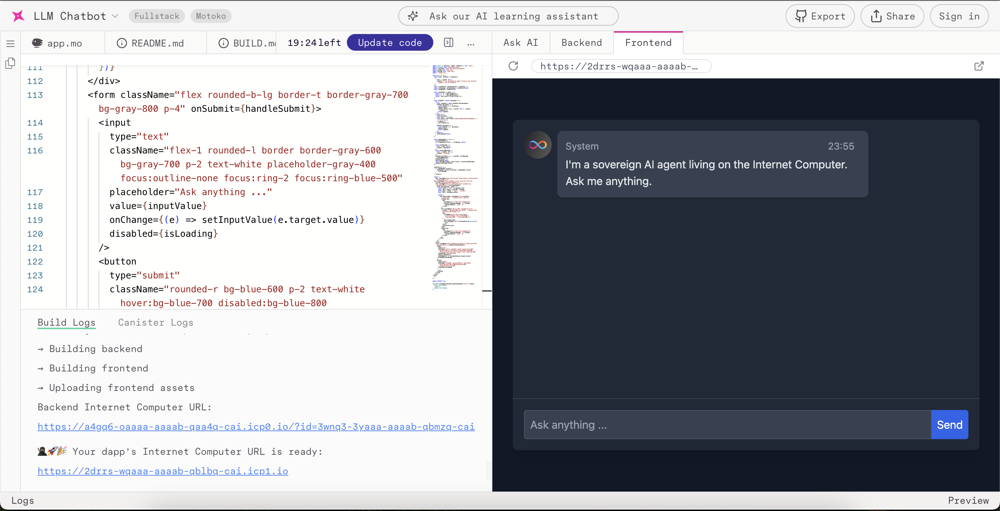

# Create an LLM Chatbot using ICP Ninja & LLM Canister 

## Section 2: Create a chatbot on ICP Ninja using LLM Canister: 

We'll go to [icp.ninja](https://icp.ninja), go to the **fork a project** section and click on the **LLM chatbot** project.


We'll then select our preferred language, in this case we'll be using **motoko**

This is what we'll see after opening the project: 


### 📁 Project Structure:
We have two main folders, the **backend**  and **frontend** folders
- The **backend** folder contains the **motoko canister** located in the **app.mo** file.
- The **frontend** folder contains the code for the chatbot interface, which is responsible for displaying the chat messages and handling the user input.
- You can Edit the **mops.toml** file to add Motoko dependencies to the project.

We can now click on the deploy button on the top right corner to **deploy** the project on mainnet playground. This is more of the testnet version of icp mainnet. The project will only be available via the generated link for 20 minutes. 

Once deployed, this is what you'll see in the terminal 


The UI (both backend and frontend) are available in the right section of the IDE 


You can now start editing the backend and frontend code to build your project

### 🤖 Create a simple llm chatbot: 

You can now edit your **app.mo** code to use a system prompt: 
```motoko 
public func chat(messages : [LLM.ChatMessage]) : async Text {
    await LLM.chat(#Llama3_1_8B, [
       {
        role = #system_;
        content = "You are a helpful assistant that is very knowledgable in develping canisters and dApps on Internet Computer";
      }, 
      // We need to properly format the user messages
      // This assumes the last message is what we want to send
      {
        role = #user; 
        content = messages[messages.size() - 1].content; 
      }
    ]);
  };
```

You can now re-deploy your project and test the new changes. Try out the prompt: `Hi there, how can you assist me?` and evaluate the response you'll get from the chatbot.

### 🤝 Using the inbuilt **Ask AI** feature: 
You can now directly "vibe code" with the AI Assistant provided for you 

Highlight on the section you'd want to make a change, `right click` on it or `ctrl + right click` and select each of the different options: 
Ask AI: `Explain, fix, improve or modify`


Click on `modify` give it a prompt like `Add a dark theme to the chatbot`



And you can see it made all the modifications: 


### 📤 Exporting your code to github: 
Once you're done with creating your project, you'll need to export it to GitHub to collaborate with your colleagues and share your work.

Click on the `export` button in the top right corner of the IDE 

Log in with GitHub, and once it's done you'll see the link to your project returned 

And that's all you need to start your project! 

## ``(Showcase)`` Lookup Agent using LLM Canister

Beyond a basic chat bot, the `llm canister` can also be used to create an `autonomous AI Agent` that can reason and act — in this case, to ``fetch the price of ICP from the ICP ledger``.

Let's explore how to build a specialized agent that can look up ICP account balances.