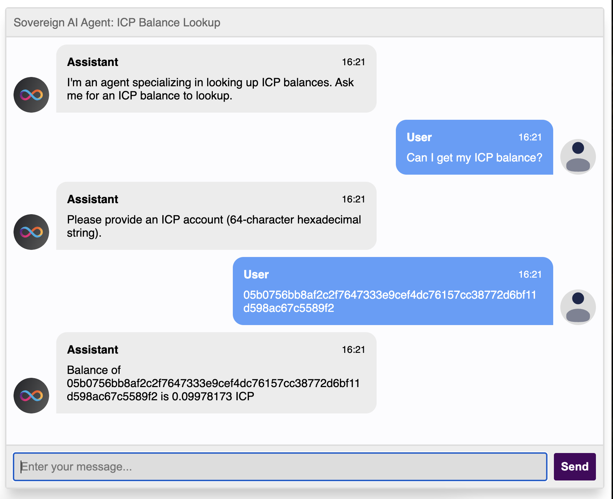

# What is a Lookup Agent?

A lookup agent is a specialized AI agent that performs a specific task - in this case, looking up ICP account balances. It demonstrates how to:
1. Create a focused AI agent with a specific purpose
2. Integrate with other canisters (like the ICP Ledger)
3. Process and validate user inputs
4. Handle complex workflows with the LLM



### Step-by-Step Implementation

#### 1. Clone and Setup the Example

First, clone the example repository:

```bash
git clone https://github.com/dfinity/llm.git
cd llm/examples/icp-lookup-agent-rust
```

#### 2. Deployment Options

You have two options for deploying the lookup agent:

##### Option A: Local Deployment with Ollama (Recommended)

This option gives you more control and better performance:

1. Install Ollama from [ollama.com](https://ollama.com/)
2. Start the Ollama server:
   ```bash
   ollama serve
   ```
3. Download the required model:
   ```bash
   ollama run llama3.1:8b
   ```
4. Deploy the canisters:
   ```bash
   dfx start --clean
   dfx deps pull
   dfx deploy
   dfx deps deploy
   ```

Benefits of local deployment:
- Faster response times
- No rate limiting
- Full control over the LLM model
- Better for development and testing
- Can customize model parameters

##### Option B: Playground Deployment

For quick testing or demonstrations:

1. Deploy to the playground:
   ```bash
   dfx deploy --playground
   ```

Limitations of playground deployment:
- Slower response times due to shared resources
- Rate limiting may apply
- Limited control over model parameters
- Best for quick demos or testing

#### 3. Understanding the Code

The example implements a lookup agent that can check ICP account balances. Here's how it works:

1. **System Prompt**: The agent uses a specialized system prompt that defines its behavior:
   ```rust
   const SYSTEM_PROMPT: &str = "You are an assistant that specializes in looking up the balance of ICP accounts...";
   ```

2. **Account Lookup**: The agent can query the ICP Ledger canister to get account balances:
   ```rust
   async fn lookup_account(account: &str) -> String {
       // Validates and looks up account balance
   }
   ```

3. **Chat Interface**: The main chat function processes user messages and handles the lookup workflow:
   ```rust
   #[ic_cdk::update]
   async fn chat(messages: Vec<ChatMessage>) -> String {
       // Processes messages and performs lookups
   }
   ```

#### 4. Testing the Agent

Once deployed, you can test the agent with various inputs:

1. **Valid Account Lookup**:
   ```
   User: "What's the balance of 1234567890abcdef1234567890abcdef1234567890abcdef1234567890abcdef?"
   Agent: "Balance of 1234567890abcdef1234567890abcdef1234567890abcdef1234567890abcdef is X ICP"
   ```

2. **Invalid Input**:
   ```
   User: "What's my balance?"
   Agent: "Please provide an ICP account (64-character hexadecimal string)."
   ```

3. **General Questions**:
   ```
   User: "What can you do?"
   Agent: "I am an agent specializing in looking up ICP balances. You can give me an ICP account and I can look up its balance."
   ```

### Key Features

1. **Specialized Functionality**: The agent is focused on one task - looking up ICP balances
2. **Input Validation**: Ensures proper account format before making ledger calls
3. **Clear Communication**: Provides helpful guidance for invalid inputs
4. **Integration**: Seamlessly works with the ICP Ledger canister
5. **Error Handling**: Gracefully handles invalid accounts and failed lookups

### Best Practices

1. **Clear System Prompt**: Define explicit rules and behaviors
2. **Input Validation**: Always validate user input before processing
3. **Error Handling**: Provide clear error messages
4. **Integration Testing**: Test with various input scenarios
5. **Documentation**: Maintain clear documentation of the agent's capabilities

This example demonstrates how to create a focused, task-specific AI agent on the Internet Computer. You can use this pattern to build other specialized agents for different purposes.

You can check out the official repository for the different examples on how to use the llm canister [here](https://github.com/dfinity/llm)