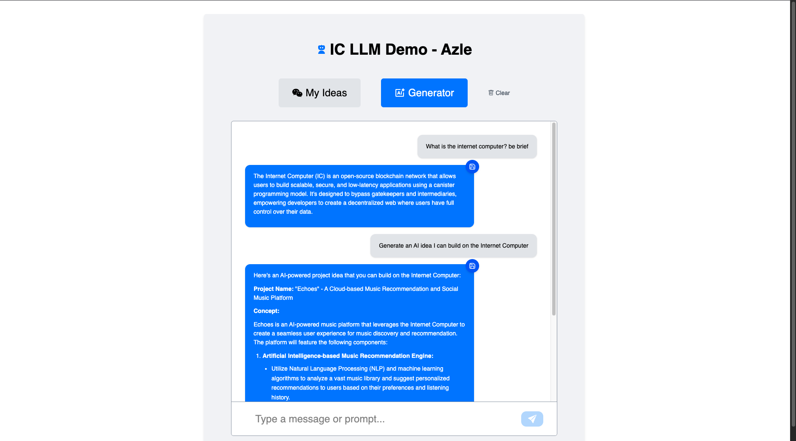

# IC LLM Demo - Azle

A simple web application that leverages the Internet Computer Protocol (ICP) to interact with large language models (LLMs).


## Libraries

- **IC LLM Frontend Client** [here](https://www.npmjs.com/package/icp-llm-client)

## Features

- **Chat with AI**: Engage with Llama3-1-8B model through a clean, intuitive interface
- **Save Ideas**: Store interesting AI-generated responses for later reference

## Tech Stack

- **Frontend**: React with TypeScript and Tailwind CSS
- **Backend**: Azle canister running on the Internet Computer
- **LLM Integration**: ICP-LLM-Client for seamless AI model interaction

## How It Works

The application connects to Llama3-1-8B through the ICP-LLM-Client, sending user prompts and rendering AI responses in a chat-like interface. Users can save interesting responses to their collection, which are stored on the ICP blockchain via Azle canisters.

## Screenshots



## Local Deployment

```bash
dfx start --clean --background #start a new replica on the background

cd DeAI/azle-llm # navigate to the azle llm dir

npm install # install project deps

dfx deploy #to deploy both backend and frontend canisters

npm run dev #start a local dev server

```
