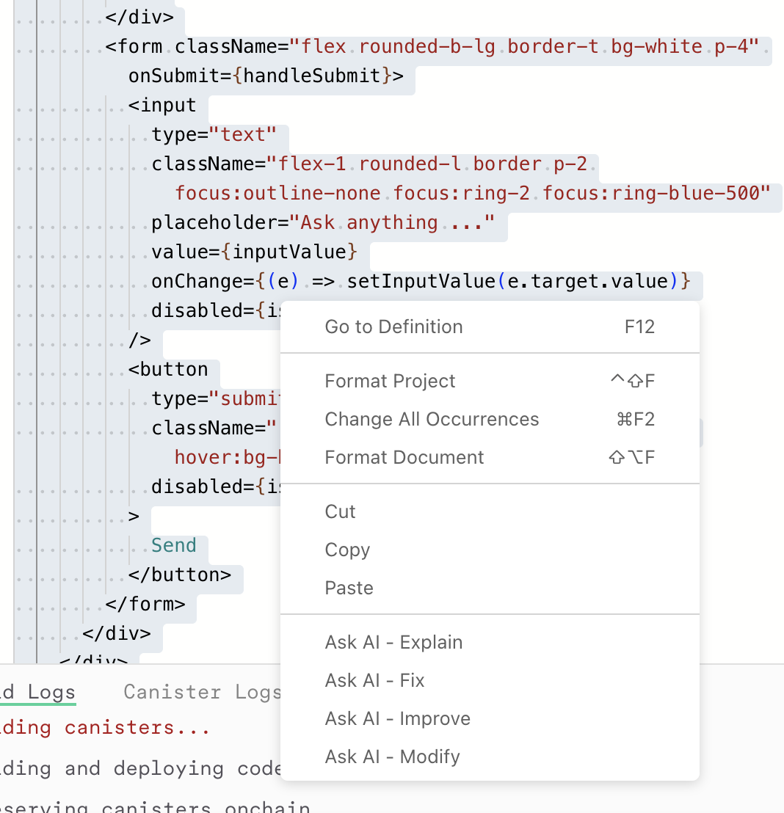

# Create an LLM Chatbot using ICP Ninja & LLM Canister 

## 📑 Table of Contents
1. [Introduction to ICP Ninja](#introduction-to-icp-ninja)
2. [Introduction to LLM Canister](#introduction-to-llm-canister)
3. [Create an LLM Chatbot using ICP Ninja & LLM Canister](#create-an-llm-chatbot-using-icp-ninja--llm-canister)

# Introduction to ICP Ninja 

> ICP Ninja is a Web Based development environment that is designed to simplify the creation and deployment of applications on ICP

It will help developers who want to quickluy get started with building on ICP, without going through the whole process of complex setups 

## What is ICP Ninja: 
[ICP Ninja](https://icp.ninja) is a browser based IDE (Intergrated Development Environment) that allows someone to: 
* Directly build and deplpy ICP canisters directly from the web browser 
* Develop applications without downloading the canister development kit (CDK), create a developer identity, or acquire cycles
* Access project templates that show ICP's unique capabilities 
* Deploy projects with a simple click of a button 

📝 Check out the official article [here](https://medium.com/dfinity/enhancing-icp-dapp-development-using-icp-ninja-ai-11d5dad408ef#6423)

## ✨ Key features: 
ICP Ninja has these key features: 
1. **Easy Deployment**: Select a template project and click "Deploy" to get your application running on the mainnet
2. **Multiple language support**: Develop in Motoko, Rust, and (in pipeline) Typescript & Python
3. **AI Learning Assistant**: get help with code explanation, fixing and optimization from AI assistant trained on the documentation 
4. **Project Sharing**: Share whatever projects you've made with others via direct links, or export to GitHub 
5. **Authentication Options:** Log in with [internet identity](https://internetcomputer.org/internet-identity) or [Github](https://github.com/) to save your progress
6. **Developer Tools:** Access canister logging, live project compilation logs, and a professional code editor

## 🚀 Getting started & How to use ICP Ninja: 
1. **Access the platform**: Visit [icp.ninja](https://icp.ninja)


2. **Choose a project**: Select from example templates or start a new project

### Create a new project and start from scratch 


* Select the project type: whether fullstack, backend only or frontend only 
* Select the backend language, currently supported ones are motoko and rust only 
* Click on "Create Project" to get started

**OR**

From the example templates, click on the project you want to use.


For my case I've choosen LLM Chatbot 


* I will then select my preferred language, motoko or rust
* Then check out the 13 steps that serve as an introduction to make you familiar with the online IDE. Go through them keenly to understand the editor and utilize the different features present. 

> **Note**: Deployed projects remain active for 20 minutes but can be redeployed as needed. For long-term development, you'll want to migrate to a local environment.

Now that we have an understanding of ICP Ninja, let's proceed to create an LLM Chatbot using ICP Ninja and the LLM Canister. 

# Create an LLM Chatbot using ICP Ninja & LLM Canister 

## Section 1: Introduction to LLM Canister: 

LLMs can now be accessed directly from a canister with just a few lines of code. This guide will help you understand how it works and get started quickly.

### 🔄 How does it work?

The LLM Canister system uses "AI Workers" to process prompts efficiently and securely.

**AI Workers:** These are stateless nodes that are set up for the sole purpose of processing LLM prompts.

### 📊 System Architecture Flow


### 🔍 Process Overview:
1. Your canister sends prompts to the LLM canister
2. LLM Canister queues the prompts
3. AI Workers continuously check for new prompts
4. AI Workers process the prompts using Llama 3.1 8B
5. Responses are returned to the LLM Canister
6. Your canister receives the processed result

## 💻 Quick Start

### Rust Example
```rust
use ic_llm::Model;

// Simple prompt
ic_llm::prompt(Model::Llama3_1_8B, "What's the speed of light?").await;

// Chat with multiple messages: when you want your model to maintain context accross multiple messages e.g chat message or when simulating a conversation
use ic_llm::{ChatMessage, Role};

ic_llm::chat(
    Model::Llama3_1_8B,
    vec![
        ChatMessage {
            role: Role::System, // System sets the context behaviour of the model
            content: "You are a helpful assistant".to_string(),
        },
        ChatMessage {
            role: Role::User, // This represents the user's inputs
            content: "How big is the sun?".to_string(),
        },
    ],
).await;
```

### Motoko Example
```motoko
import LLM "mo:llm";
// Simple prompt
await LLM.prompt(#Llama3_1_8B, "What's the speed of light?");

// Chat with multiple messages
await LLM.chat(#Llama3_1_8B, [
  {
    role = #system_;
    content = "You are a helpful assistant.";
  },
  {
    role = #user;
    content = "How big is the sun?";
  }
]);
```

## ℹ️ Important Details

### Current Status
- LLM Canister Principal: `w36hm-eqaaa-aaaal-qr76a-cai`
- The LLM Canister is currently controlled by the DFINITY team (until stability is achieved)
- AI Workers are managed by the DFINITY team
- Service is currently free to use

### 📚 Libraries
1. [Rust Library](https://docs.rs/ic-llm/latest/ic_llm/)
2. [Motoko Library](https://mops.one/llm)

### ⚠️ Limitations
1. **Model Support:**
   - Currently only Llama 3.1 8B model is supported
   - More models planned based on community feedback

2. **Request Constraints:**
   - Maximum 10 messages per chat request
   - Prompt length across all messages cannot exceed `10kiB`
   - Output is limited to `200` tokens

### 🔒 Privacy Considerations
- Prompts are not completely private
- AI Worker operators can theoretically see prompts
- User identity remains anonymous
- DFINITY only logs aggregate metrics (request counts, token usage)

## 🔮 Future Developments
1. **Latency Improvements:**
   - Working on reducing end-to-end request time
   - Exploring non-replicated mode for faster response

2. **Decentralization Plans:**
   - Moving towards decentralized AI worker deployment
   - Exploring "badlands" concept for permissionless worker operation

## Section 2: Create a chatbot on ICP Ninja using LLM Canister: 

We'll go to [icp.ninja](https://icp.ninja), go to the **fork a project** section and click on the **LLM chatbot** project.


We'll then select our preferred language, in this case we'll be using **motoko**

This is what we'll see after opening the project: 


### 📁 Project Structure:
We have two main folders, the **backend**  and **frontend** folders
- The **backend** folder contains the **motoko canister** located in the **app.mo** file.
- The **frontend** folder contains the code for the chatbot interface, which is responsible for displaying the chat messages and handling the user input.
- You can Edit the **mops.toml** file to add Motoko dependencies to the project.

We can now click on the deploy button on the top right corner to **deploy** the project on mainnet playground. This is more of the testnet version of icp mainnet. The project will only be available via the generated link for 20 minutes. 

Once deployed, this is what you'll see in the terminal 


The UI (both backend and frontend) are available in the right section of the IDE 


You can now start editing the backend and frontend code to build your project

### 🤖 Create a simple llm chatbot: 

You can now edit your **app.mo** code to use a system prompt: 
```motoko 
public func chat(messages : [LLM.ChatMessage]) : async Text {
    await LLM.chat(#Llama3_1_8B, [
       {
        role = #system_;
        content = "You are a helpful assistant that is very knowledgable in develping canisters and dApps on Internet Computer";
      }, 
      // We need to properly format the user messages
      // This assumes the last message is what we want to send
      {
        role = #user; 
        content = messages[messages.size() - 1].content; 
      }
    ]);
  };
```

You can now re-deploy your project and test the new changes. Try out the prompt: `Hi there, how can you assist me?` and evaluate the response you'll get from the chatbot.

### 🤝 Using the inbuilt **Ask AI** feature: 
You can now directly "vibe code" with the AI Assistant provided for you 

Highlight on the section you'd want to make a change, `right click` on it or `ctrl + right click` and select each of the different options: 
Ask AI: `Explain, fix, improve or modify`


Click on `modify` give it a prompt like `Add a dark theme to the chatbot`


And you can see it made all the modifications: 


### 📤 Exporting your code to github: 
Once you're done with creating your project, you'll need to export it to GitHub to collaborate with your colleagues and share your work.

Click on the `export` button in the top right corner of the IDE 

Log in with GitHub, and once it's done you'll see the link to your project returned 


And that's all you need to start your project! 