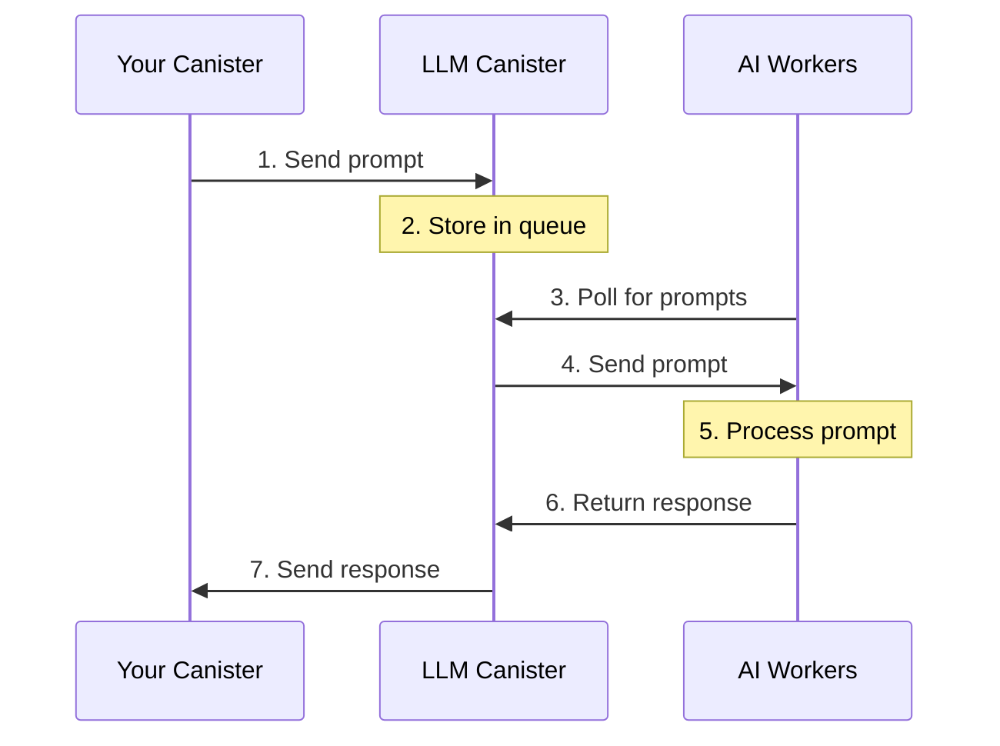
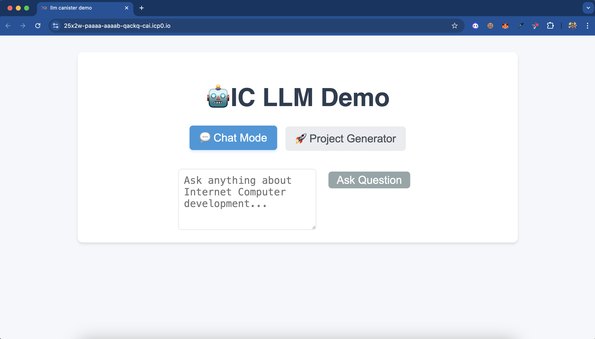

# LLM Canister: Deploy AI Agents with just a few lines of code

LLMs can now be accessed directly from a canister with just a few lines of code. This guide will help you understand how it works and get started quickly.

## How does it work?

The LLM Canister system uses "AI Workers" to process prompts efficiently and securely.

**AI Workers:** These are stateless nodes that are set up for the sole purpose of processing LLM prompts.

### System Architecture Flow



### Process Overview:
1. Your canister sends prompts to the LLM canister
2. LLM Canister queues the prompts
3. AI Workers continuously check for new prompts
4. AI Workers process the prompts using Llama 3.1 8B
5. Responses are returned to the LLM Canister
6. Your canister receives the processed result

## Quick Start

### Rust Example
```rust
use ic_llm::Model;

// Simple prompt
ic_llm::prompt(Model::Llama3_1_8B, "What's the speed of light?").await;

// Chat with multiple messages: when you want your model to maintain context accross multiple messages e.g chat message or when simulating a conversation
use ic_llm::{ChatMessage, Role};

ic_llm::chat(
    Model::Llama3_1_8B,
    vec![
        ChatMessage {
            role: Role::System, // System sets the context behaviour of the model
            content: "You are a helpful assistant".to_string(),
        },
        ChatMessage {
            role: Role::User, // This represents the user's inputs
            content: "How big is the sun?".to_string(),
        },
    ],
).await;
```

### Motoko Example
```motoko
import LLM "mo:llm";
// Simple prompt
await LLM.prompt(#Llama3_1_8B, "What's the speed of light?");

// Chat with multiple messages
await LLM.chat(#Llama3_1_8B, [
  {
    role = #system_;
    content = "You are a helpful assistant.";
  },
  {
    role = #user;
    content = "How big is the sun?";
  }
]);
```

## Important Details

### Current Status
- LLM Canister Principal: `w36hm-eqaaa-aaaal-qr76a-cai`
- The LLM Canister is currently controlled by the DFINITY team (until stability is achieved)
- AI Workers are managed by the DFINITY team
- Service is currently free to use

### Libraries
1. [Rust Library](https://docs.rs/ic-llm/latest/ic_llm/)
2. [Motoko Library](https://mops.one/llm)

### Limitations
1. Model Support:
   - Currently only Llama 3.1 8B model is supported
   - More models planned based on community feedback

2. Request Constraints:
   - Maximum 10 messages per chat request
   - Prompt length across all messages cannot exceed `10kiB`
   - Output is limited to `200` tokens

### Privacy Considerations
- Prompts are not completely private
- AI Worker operators can theoretically see prompts
- User identity remains anonymous
- DFINITY only logs aggregate metrics (request counts, token usage)

## Future Developments
1. Latency Improvements:
   - Working on reducing end-to-end request time
   - Exploring non-replicated mode for faster response

2. Decentralization Plans:
   - Moving towards decentralized AI worker deployment
   - Exploring "badlands" concept for permissionless worker operation

## Resources
- [Community Forum Discussion](https://forum.dfinity.org/t/introducing-the-llm-canister-deploy-ai-agents-with-a-few-lines-of-code/41424)
- [IC LLM Notebook](https://github.com/onicai/ic_llm_notebook)


# LLM Canister Demo

A demonstration project showing how to integrate ICPs LLM canister in your project. This project includes a simple Q&A interface and a basic project (code) generator.

## Setup Instructions

1. **Clone the Repository**
   ```bash
   git clone https://github.com/ICP-Hub-Kenya/DeAI
   cd DeAI/llm_canister 
   ```

2. **Run the bash script to setup the project**
    ```bash
    npm run setup
    ```

3. **Start Local Network**
   ```bash
   dfx start --clean --background
   ```

4. **Deploy the Canister**
   ```bash
   npm install -g canister-tools # install canister tools for generating dids file for the rust canister
   npx generate-did backend # generate the dids file for the backend canister

   dfx deploy --playground # deploy the canister to the playground, it only works on the playground because it calls the llm canister on mainnet
   ```

This is what you'll see: 


## Project Structure

```
llm_canister/
├── src/
│   ├── backend/
│   │   └── src/
│   │       └── lib.rs      # Main backend canister code
│   └── frontend/
│       └── src/
│           ├── App.jsx     # React frontend
│           └── App.css     # Styling
```

## Backend Code Explanation

The backend canister (`lib.rs`) demonstrates three main uses of the IC LLM:

### 1. Simple Q&A Functionality
```rust
#[ic_cdk::update]
async fn ask_question(question: String) -> String {
    let messages = vec![
        ChatMessage {
            role: Role::System,
            content: "You are a helpful assistant that specializes in Internet Computer development.".to_string(),
        },
        ChatMessage {
            role: Role::User,
            content: question,
        },
    ];

    ic_llm::chat(Model::Llama3_1_8B, messages).await
}
```
This function:
- Takes a user question as input
- Creates a chat context with system and user messages
- Uses the Llama 3 1.8B model for responses
- Returns the response as a string

### 2. Direct Prompt Usage
```rust
#[ic_cdk::update]
async fn quick_prompt(prompt: String) -> String {
    ic_llm::prompt(Model::Llama3_1_8B, prompt).await
}
```
This demonstrates direct prompting:
- Simpler than chat mode
- Useful for straightforward generations
- No conversation context needed

### 3. Project Generator
```rust
#[derive(CandidType)]
pub struct SimpleProject {
    canister_code: String,
    dfx_json: String,
    readme: String,
}

#[ic_cdk::update]
async fn generate_simple_project(name: String, description: String, language: String) -> SimpleProject {
    // ... generation logic
}
```
The project generator:
- Takes project details as input
- Generates canister code, dfx.json, and README
- Uses specific prompts for each file type
- Cleans and formats the responses

## Using the IC LLM in Your Projects

### 1. Add Dependencies
In your `Cargo.toml`:
```toml
[dependencies]
candid = "0.10"
ic-cdk = "0.17.0"
ic-llm = "0.4.0"
```

### 2. Import Required Types
```rust
use candid::CandidType;
use ic_llm::{Model, ChatMessage, Role};
```

### 3. Create Chat Messages
```rust
let messages = vec![
    ChatMessage {
        role: Role::System,
        content: "System prompt here".to_string(),
    },
    ChatMessage {
        role: Role::User,
        content: "User message here".to_string(),
    },
];
```

### 4. Make LLM Calls
```rust
// Chat mode
let response = ic_llm::chat(Model::Llama3_1_8B, messages).await;

// Direct prompt mode
let response = ic_llm::prompt(Model::Llama3_1_8B, "Your prompt here").await;
```

## Best Practices

1. **Prompt Engineering**
   - Be specific in your prompts
   - Include examples when needed
   - Use system messages to set context

2. **Response Handling**
   - Clean and validate responses
   - Handle markdown and code blocks appropriately
   - Implement error handling

3. **Performance**
   - Keep prompts concise
   - Cache responses when appropriate
   - Consider rate limiting for production use

## Common Issues and Solutions

1. **Response Formatting**
   ```rust
   fn clean_code_response(code: String) -> String {
       code.lines()
           .skip_while(|line| {
               line.is_empty() 
               || line.contains("Here's") 
               || line.contains("```")
           })
           .collect::<Vec<&str>>()
           .join("\n")
           .trim()
           .to_string()
   }
   ```

2. **Error Handling**
   - Implement proper error types
   - Handle network timeouts
   - Validate LLM responses

## Contributing

Feel free to submit issues and enhancement requests!
