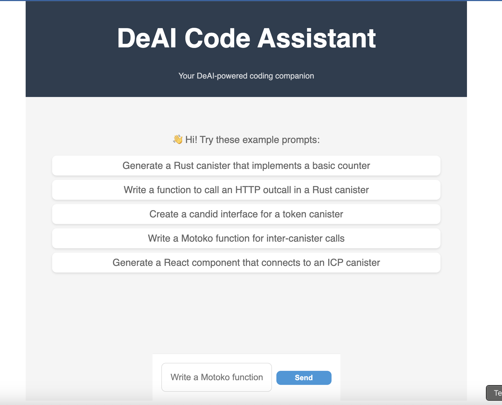

# Tutorial: Building DeAI with ICP HTTP Outcalls 

https://github.com/user-attachments/assets/b8f7d2ea-87b1-41b1-b0d7-b364fdffc666

## Introduction to DeAI with HTTP Outcalls: 
The most basic form of decentralized AI involves smart contracts making HTTP requests to Web2 AI services. While not fully decentralized, this approach leverages ICP's unique HTTP outcalls feature to bridge traditional AI services with on-chain logic. 

## Understanding HTTP Outcalls in ICP: 
ICP canisters can make HTTPS requests to external services, enabling integration with Web2 APIs. This feature is crucial for:

- Accessing AI models without hosting them on-chain
- Maintaining flexibility with different AI providers
- Reducing computational load on the canister

Check out full documentation on [HTTPs outcalls](https://internetcomputer.org/docs/current/developer-docs/smart-contracts/advanced-features/https-outcalls/https-outcalls-overview)

## Why Use a Proxy?
Direct calls from ICP canisters to OpenAI's API present several challenges:

1. Rate limiting: multiple replicas in the subnet make simultaneous requests, potentially exceeding rate limits.
2. Response transformation and error handling: a proxy will help normalize responses and handle errors.
3. Security of API credentials: we need to use proxys to securely store API keys or any other sensitive data. 
4. IPv6 requirement: ICP requires external HTTPs outcalls to be made to IPv6 addresses. Many APIs (including Open AIs) do not support IPv6. The proxy allows translation between IPv4 and IPv6 requests. 

Our solution uses a Supabase Edge Function as a proxy to:

- Securely store API keys
- Handle request/response formatting
- Manage rate limiting

## Getting started

1. Clone the repository: 
```bash 
git clone https://github.com/ICP-Hub-Kenya/DeAI.git 

cd rust-openai
``` 

2. Set up supabase and add your OpenAI API key to the environment variables.

- Documentation on getting started with Edge Functions can be found [here](https://supabase.com/docs/guides/functions/quickstart)

- Documentation on how to deploy Edge Functions can be found [here](https://supabase.com/docs/guides/functions/deploy)

- Add your OpenAI API key to the environment variables. Check out the documentation [here](https://supabase.com/docs/guides/functions/secrets)
```typescript
const OPENAI_API_KEY = Deno.env.get('OPENAI_API_KEY')
``` 

Once you've set it up end deployed your edge functions, the next step is to add the URL of your edge function to the backend canister
```rust 
let supabase_url = "https://<PROJECT_ID>.supabase.co/functions/v1/<FUNCTION_NAME>";
``` 

3. Deploy the canister: 

```bash
# Generate the did files 
npx generate-did rust_openai_backend

# Deploy the canister
dfx deploy rust_openai_backend
``` 

4. Run the frontend: 
```bash
npm run start
``` 

Now you have your project running and you can test it out. 



